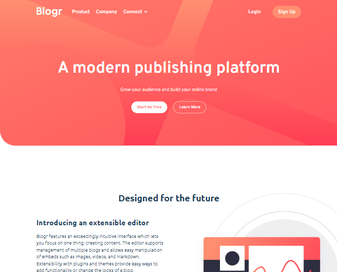

<h1 text-align="center">Blogr</h1>

Uma landing page sobre uma plataforma de conteúdo/blog fictícia.

---

Este projeto foi parte do desafio <a href="https://www.frontendmentor.io/challenges/blogr-landing-page-EX2RLAApP">Blogr</a> da plataforma FrontEnd Mentor.

 <a href="#tecnologias">Tecnologias</a> | 
 <a href="#identidade">Identidade</a> | 
 <a href="#links">Links</a> |
 <a href="#redes">Redes</a>

---

### Visão Geral

#### Tecnologias

- HTML5 semântico
- Propriedades CSS customizadas
- Flexbox
- SASS Compiler
- Mobile-first Workflow
- JavaScript

---

#### Identidade

---

#### Links

<!-- 
<a href="" target="_blank">Live Site URL</a>
 -->

#### Redes

Perfil do FrontEnd Mentor - <a href="https://www.frontendmentor.io/profile/oliverids">@oliverids</a>

